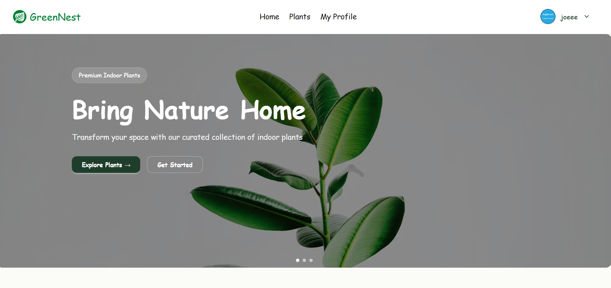
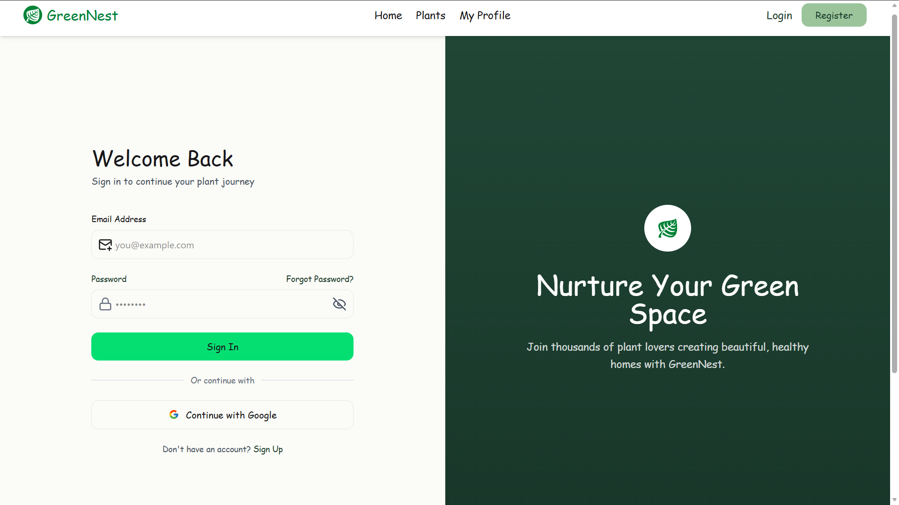
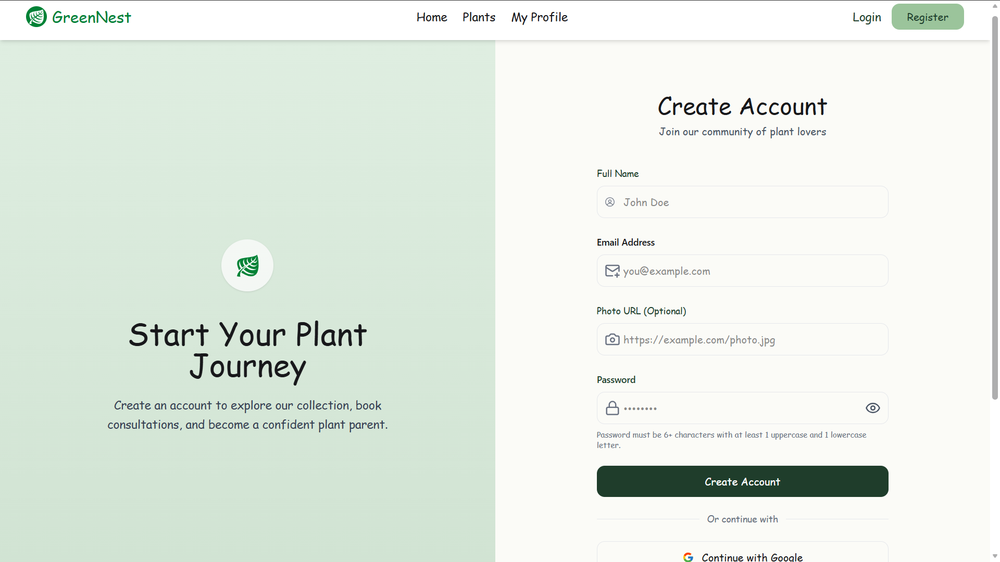
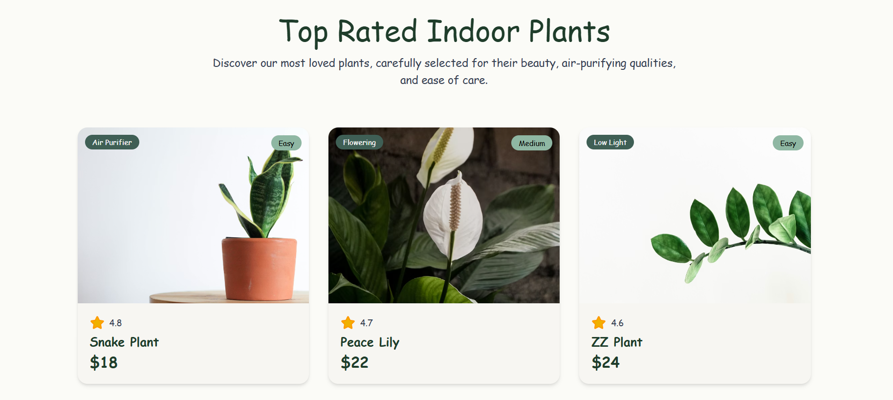
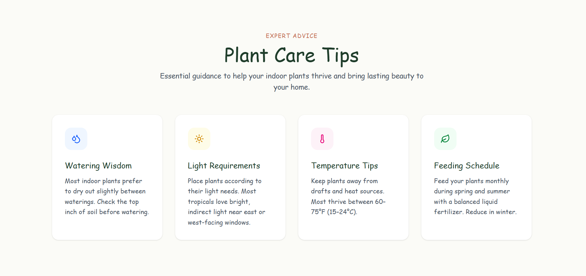

<div align="center">


<br/>


[](LICENSE)
[]()

<br/>

</div>

---

## 📖 Overview

**TreePlantShop** is a fully responsive React-based e-commerce web application for browsing and purchasing trees and plants. It offers a smooth shopping experience with product listings, a dynamic cart system, and Firebase-powered user authentication — all built with a clean, nature-inspired UI using Vite for blazing-fast development.

---

## ✨ Features

| Feature                    | Description                                                              |
| -------------------------- | ------------------------------------------------------------------------ |
| 🌱 **Product Listing**     | Browse a curated collection of trees and plants with details and pricing |
| 🛒 **Shopping Cart**       | Add, remove, and update item quantities with real-time total calculation |
| 🔐 **User Authentication** | Register and log in securely via Firebase Auth                           |
| 📱 **Responsive Design**   | Fully optimized for desktop, tablet, and mobile devices                  |

---

## 🛠️ Tech Stack

- **Framework** — React.js
- **Build Tool** — Vite
- **Language** — JavaScript (ES6+)
- **Styling** — CSS3
- **Authentication & Backend** — Firebase
- **Routing** — React Router DOM
- **State Management** — React Context API

---

## 🚀 Getting Started

### Prerequisites

Make sure you have the following installed:

- [Node.js](https://nodejs.org/) (v16 or above)
- [Git](https://git-scm.com/)

### Installation

```bash
# 1. Clone the repository
git clone https://github.com/tauhid4678/TreePlantShop.git

# 2. Navigate into the project directory
cd TreePlantShop

# 3. Install dependencies
npm install

# 4. Start the development server
npm run dev
```

The app will run at **http://localhost:5173**

---

## 🔥 Firebase Setup

1. Go to [Firebase Console](https://console.firebase.google.com/) and create a new project
2. Enable **Authentication** (Email/Password)
3. Copy your Firebase config and create a `.env` file in the root:

```env
VITE_FIREBASE_API_KEY=your_api_key
VITE_FIREBASE_AUTH_DOMAIN=your_auth_domain
VITE_FIREBASE_PROJECT_ID=your_project_id
VITE_FIREBASE_STORAGE_BUCKET=your_storage_bucket
VITE_FIREBASE_MESSAGING_SENDER_ID=your_sender_id
VITE_FIREBASE_APP_ID=your_app_id
```

---

## 📁 Project Structure

```
TreePlantShop/
├── public/                   # Static public assets
├── src/
│   ├── Components/           # Reusable UI components
│   ├── Layouts/              # Layout wrappers (Navbar, Footer, etc.)
│   ├── Pages/                # Page-level components (Home, Shop, Cart, etc.)
│   ├── Routes/               # App route definitions
│   ├── assets/               # Images and static files
│   ├── contexts/             # React Context providers (Auth, Cart)
│   ├── firebase/             # Firebase config & initialization
│   ├── hooks/                # Custom React hooks
│   ├── index.css             # Global styles
│   └── main.jsx              # App entry point
├── .gitignore
├── eslint.config.js
├── index.html                # HTML entry point
├── package.json
├── package-lock.json
├── vite.config.js
└── README.md
```

---

## 📸 Screenshots
Home
 


Login



Register 



Top Plants 



Tips



Team Section 


---

## 🌐 Live Demo

> 🔗 [https://treeplantguide.netlify.app/]

---

## 🤝 Contributing

Contributions are welcome! Here's how:

```bash
# 1. Fork the project
# 2. Create your feature branch
git checkout -b feature/your-feature-name

# 3. Commit your changes
git commit -m "Add: your feature description"

# 4. Push to your branch
git push origin feature/your-feature-name

# 5. Open a Pull Request
```

---

## 👨‍💻 Author

**Md. Tauhid Hasan**

[](https://github.com/tauhid4678)
[](https://linkedin.com/in/md-tauhid-hasan)

---

<div align="center">


<sub>Made with 💚 by Md. Tauhid Hasan</sub>

</div>
